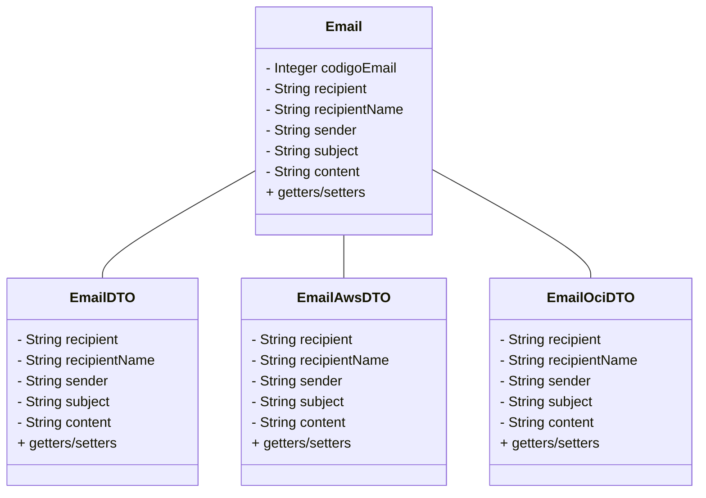

# Projeto de Aplicação REST - Desafio Técnico Viasoft

## Sobre o Projeto

Este projeto é uma aplicação REST desenvolvida como parte de um desafio técnico para a empresa Viasoft. Ele oferece funcionalidades de envio de e-mail simples e e-mail via OCI ou AWS, dependendo das configurações no arquivo `application.properties`.

## Tecnologias Utilizadas

- **Java 17**
- **Spring Boot**
- **Postman** para testes

## Funcionalidades

1. **Envio de E-mail Simples**
2. **Envio de E-mail via OCI ou AWS**

## Estrutura do Projeto

O projeto inclui um modelo de classe que representa um e-mail, conforme mostrado no diagrama de classes abaixo:

## Configuração
As configurações para envio de e-mail podem ser ajustadas no arquivo application.properties, permitindo escolher entre o envio via OCI ou AWS.

## Testes
A ferramenta Postman foi utilizada para testar as funcionalidades da aplicação, garantindo que o envio de e-mails funcione corretamente em diferentes cenários configurados.
